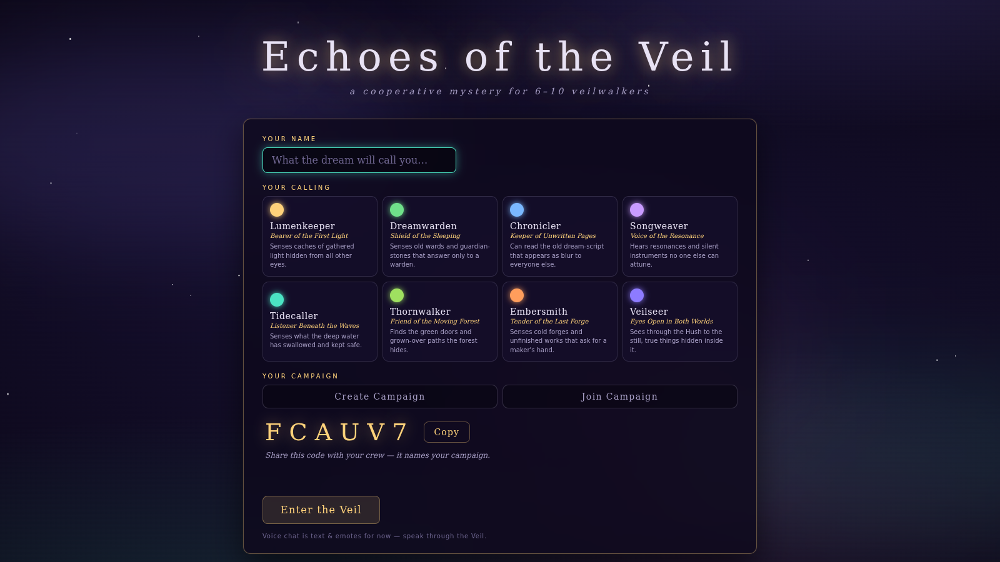
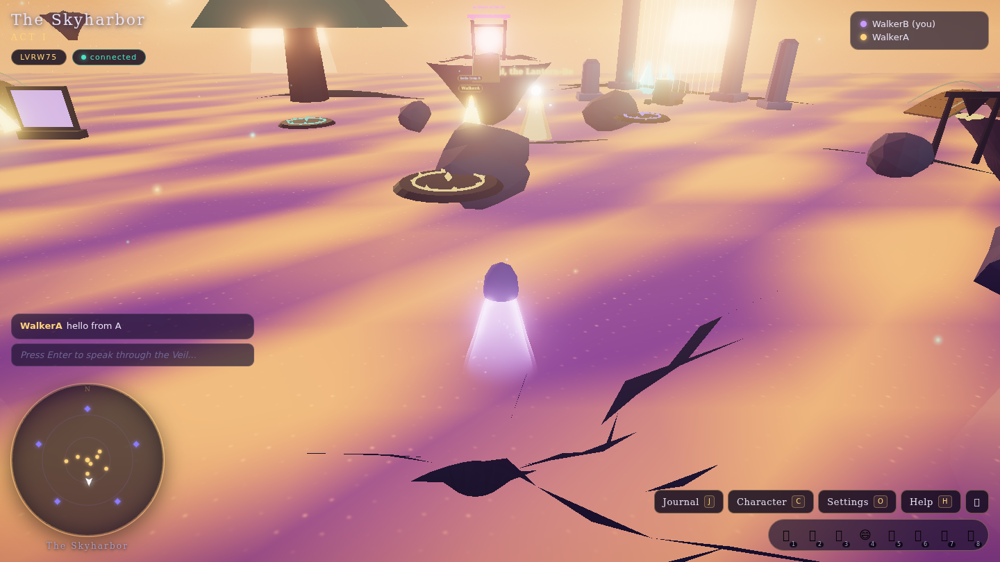

# Echoes of the Veil

A cooperative narrative mystery for **6–10 players**, played together in one
~90-minute session. You are Veilwalkers — a crew exploring a shared, living
dream-world of floating islands, corrupted crystal cities, drowned libraries
and shifting forests, gathering the scattered Echoes of the First Dreamer and
deciding, together, what the dream becomes.

Real-time multiplayer (Cloudflare Durable Objects + WebSockets), a fully
data-driven branching story with persistent consequences, an adaptive
WebAudio soundtrack, and a stylized luminous three.js world — no login, no
install: share a six-letter room code and play in a desktop browser.

| | |
| --- | --- |
|  |  |

*Screenshots are from the automated headless test run (software rendering);
it looks better on a real GPU.*

## Features

- **Six dreamscape locations** — the Skyharbor hub, Caelis the crystal city,
  the Sunken Archive, the Wandering Wood, the Mirrormere, and the Heart of
  the Veil — all procedural three.js scenes with dynamic lighting, bloom,
  god-rays, fog, skies, and thousands of particles.
- **A three-act branching campaign** (~60 story beats): co-op glyph rituals,
  moral choices resolved by group vote, relationship arcs with the Echoes,
  three endings with flag-dependent epilogues. The whole story is data in
  [`shared/storyData.ts`](shared/storyData.ts), interpreted by an
  authoritative server-side director.
- **Eight archetypes** (Lumenkeeper, Dreamwarden, Chronicler, Songweaver,
  Tidecaller, Thornwalker, Embersmith, Veilseer) — each player gets private
  archetype-gated discoveries the rest of the party can't see.
- **Focus mode** — any player can *anchor* a scene (F) to slow the moment
  down and reveal deeper, stranger prose for the whole party.
- **Shared journal, story log, party panel, character sheets, minimap,
  text + emote chat**, group choice voting with live tallies.
- **Persistence** — campaigns live in a Durable Object per room code: story
  flags, journal, inventories, relationships and player identities survive
  disconnects and resume days later.
- **Adaptive soundtrack** — six procedural WebAudio moods (menu, ambient,
  exploration, tension, climax, hopeful) that shift with the story, plus
  synthesized SFX. Drop `.ogg` files in `public/audio/` to replace any of it.

## Quick start (local)

Requirements: **Node 22.12+** and a desktop browser with WebGL2.

```sh
npm install
npm run dev
```

This starts both the Vite client (<http://localhost:5173> — Vite picks the
next port if 5173 is busy; check the terminal) and the local Cloudflare
worker (`wrangler dev`, port 8787, no Cloudflare account needed).

1. Open the client URL, enter a name, pick an archetype, **Create Campaign**.
2. Copy the room code from the menu (or the HUD chip later).
3. Open a second tab/window, **Join Campaign** with the code — you'll see
   both Veilwalkers in the party list, synced through the local Durable
   Object.

### Controls

| Input | Action |
|---|---|
| WASD / arrows, Shift to run | Move |
| Mouse drag, or click canvas for pointer lock | Look around (Esc releases) |
| Wheel | Camera zoom |
| E | Interact |
| F | Anchor / release focus mode |
| J / C / O / H | Journal / Character / Settings / Help |
| Enter | Chat · 1–8 emotes |

### Automated multiplayer checks

With `npm run dev` (or just `npm run dev:worker`) running:

```sh
npm run test:sync
```

connects two headless WebSocket clients to the local Durable Object and
verifies they observe each other's movement.

There is also a full two-tab browser test (menu → create → join → party
lists → chat) in `scripts/test-browser.mjs`; it needs a one-off
`npm i --no-save puppeteer` first — see the header comment in the script.

## Playing with friends

- **Deployed (recommended):** push to GitHub and let the included Actions
  workflow deploy to Cloudflare Pages + Workers — see
  [`docs/DEPLOYMENT.md`](docs/DEPLOYMENT.md) for the one-time setup (two
  secrets, one variable, two `wrangler` commands). Then just share your
  Pages URL and a room code.
- **LAN:** run `npx vite --host` plus `npm run dev:worker`, set
  `VITE_WORKER_URL=http://<your-lan-ip>:8787` in `.env`, and friends on the
  network open `http://<your-lan-ip>:5173`.

One ~90-minute session arc: gather in the Skyharbor → awaken the Loom (co-op
ritual) → split up across three Echo locations (each has a co-op puzzle and a
moral vote) → reunite at the Heart of the Veil for the final ritual and the
ending vote. Voice chat is not built in (see Known gaps) — use Discord or a
room of people.

## Project structure

```
shared/     wire protocol, story schema, archetypes, THE campaign data (storyData.ts)
src/        three.js client: core/ (loop, scene, post-fx) · world/ (6 locations,
            builders, particles) · player/ · net/ · story/ · audio/ · ui/
worker/     Cloudflare Worker + VeilRoom Durable Object + StoryDirector
scripts/    test-sync.mjs (two-client DO sync test)
docs/       ARCHITECTURE.md · STORY_BIBLE.md · ASSETS.md · DEPLOYMENT.md · PROMPT.md
```

How it fits together (one paragraph): the client renders and predicts only
its own avatar; everything narrative is decided by the **StoryDirector**
inside the per-campaign Durable Object, which interprets the declarative
beats/triggers/effects in `shared/storyData.ts` and broadcasts results; the
`NetworkClient` mirrors every server message into `ClientState` and emits
typed events that drive the UI, audio and world. Full contracts and flows:
[`docs/ARCHITECTURE.md`](docs/ARCHITECTURE.md).

## Extending the game

- **Story**: add beats/choices/events in `shared/storyData.ts` — schema in
  `shared/story.ts`, worked example in
  [`docs/STORY_BIBLE.md`](docs/STORY_BIBLE.md) ("Extending the story").
  The server interprets data; no engine code changes needed for new content.
- **3D assets**: every hero set-piece has a drop-in GLB swap point —
  generation prompts, target scales and import steps in
  [`docs/ASSETS.md`](docs/ASSETS.md).
- **Music/SFX**: drop `public/audio/music/<mood>.ogg` or
  `public/audio/sfx/<id>.ogg` — see [`public/audio/README.md`](public/audio/README.md).
- **A new location**: subclass `LocationBase`, register it in
  `WorldManager`, give it interactable ids, and reference them from story
  beats.

## Performance notes

- Quality presets (Settings, `O`): **low** disables bloom and drops pixel
  ratio; **high** caps device pixel ratio at 2. Default is high.
- Heavy repetition (trees, crystals, books, reeds) is `InstancedMesh`;
  particles are single-draw shader `Points`. Each location targets <300
  draw calls.
- Locations build lazily behind a loading veil and stay cached for the
  session. Compress real GLB assets before shipping
  (see [`docs/ASSETS.md`](docs/ASSETS.md)).

## Known gaps / next steps

- **Voice chat is a stub** — the mic button toasts a notice. Real voice
  needs a WebRTC SFU (e.g. Cloudflare Calls); text + emote chat work today.
  (`// TODO` in `src/ui/HUD.ts`.)
- **Offline solo mode is exploration-only** — without the worker, story
  beats, choices and persistence are inert by design (commented in
  `src/net/NetworkClient.ts`).
- **Compressed-GLB decoders not wired** — plain `.glb` swaps work; add
  DRACO/meshopt decoder registration in `src/core/AssetLoader.ts` when you
  start shipping gltfpack-compressed assets (`// TODO` in file).
- **Temporary random-event moods** revert via `setTimeout`; if the room is
  evicted mid-event the temp mood is simply replaced by the next mood
  broadcast (cosmetic). Story-critical delayed beats and group choices are
  fully durable (persisted queues drained by the room tick).
- **Identity edge case** — player identity is reclaimed per tab
  (`sessionStorage` ↔ `localStorage` handoff); if the browser is killed
  hard (no `pagehide`), the next session gets a fresh identity. Campaign
  progress is unaffected.
- **Tests run on demand, not in CI** — typecheck + build run on every deploy,
  but `test:sync` and the two-tab browser test (`scripts/test-browser.mjs`)
  need a locally running worker, so they aren't wired into the GitHub Actions
  workflow yet.

---

Story, world and code grew from the brief preserved verbatim in
[`docs/PROMPT.md`](docs/PROMPT.md). Have a good session, Veilwalkers. ✦
